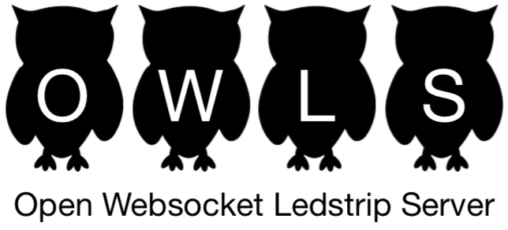

The Open Websocket Ledstrip Server started as a project for controling a ledstrip in the popular Scratch programming
language for children. Originally, I used a WS2801 ledstrip, connected to a Raspberry Pi. For this, I wrote a Python based
server process that uses a websocket to receive commands for the ledstrip. I also created an extension for Scratch v2, that
creates code blocks to control the ledstrip. The extension is a client that connects to the ledstrip server.

In 2019, Scratch v3 will become available. In Scratch v3, the extension model is changed, so a rewrite of the
existing extension will be necessary. Because I also created different implementations of the server, I needed a new
structure for the project. The result of all this is OWLS. This Github page will be updated over time and all the server and
client implementations that I made will be added here.
